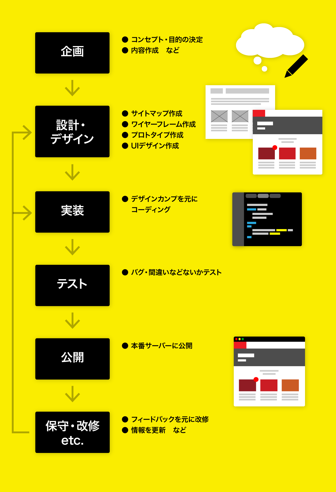

# Web 制作のフロー

完成までのおおまかな流れは以下。  
基本的に分業が多いが、一人で設計とデザイン、デザインと実装を兼業する場合や、実装だけで何人もいる場合などプロジェクトによりチームは様々。



# Web 制作の方法について

## 設計・デザインツール

`illustrator` , `Photoshop` などのグラフィックアプリや、 `XD` , `Sketch` ,`Figma` などの UI デザインに特化したアプリなどを使用する。 得意なアプリで制作すれば OK。

## 実装ツール

本授業ではコーディングは `テキストエディタ`で行うこととする。  
基本は `Visual Studio Code`を使用するが、好きなエディタや IDE があれば何でも良い。

## 開発言語について

サーバーサイドでは様々な言語が使用可能(PHP,Java,Python etc.)だが  
ブラウザが理解する言語は基本的に `HTML` `CSS` `JavaScript` のみ。  
本授業では`フロントエンド言語` のみを対称とする。

### HTML

- `マークアップ言語` の一種。
- **ページの骨格**にあたるファイルで、ページの内容・構造を`タグ` を使ってブラウザが理解できるように意味付けした**文書**。
- 拡張子は`.html`

```html
<article>
  <h1 class="title">HTMLとは</h1>
  <p>HyperText Markup Language の略</p>
</article>
```

### CSS

- ”Cascading Style Sheets”の略。`スタイルシート`とも呼ばれる。
- HTML の各タグのカラー・サイズ・レイアウトなど、ページを**装飾するため**に使用する。
- 拡張子は`.css`

```css
.title {
  color: #ff0000;
}
```

### JavaScript

- ブラウザで動作するほぼ`唯一のプログラミング言語`。 `JS`とも呼ばれる。
- ユーザーインタラクションや、WEB アプリの基幹部分まで、様々なところで使われている。
- 拡張子は`.js`

```JS
function hello(name){
    alert(`Hello`+ name)
}
hello("Doman");
```
