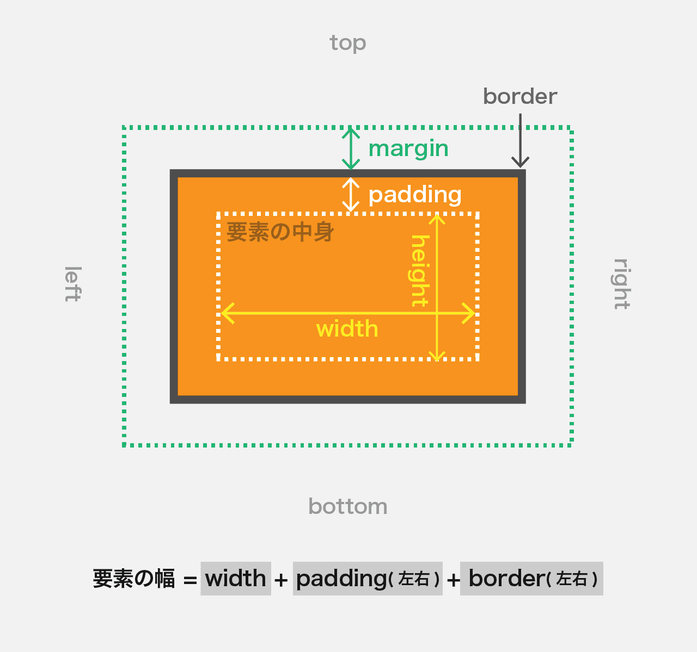

# ボックスモデルとは

すべての要素は、**ボックス**と呼ばれる矩形の領域を持っていて、ボックスは以下のスタイルから決定されます。

- 要素の幅・高さ `width` / `height`
- 内側の余白 `padding`
- 枠線 `border`
- 外側の余白 `margin`



# ボックスモデルを構成するプロパティ

## width / height (幅 / 高さ)

その要素の幅や高さを指定します。  
ただし、width/heightは **指定しなくても要素の内容によって自動的に計算されるので、不要なら指定する必要はありません**。（要素の内容とは、その要素内のテキストや画像などを指します。）

- 指定しない場合、デフォルト値は`auto` となります。
- 単位には `px` `%` `vw` `em` などが使用可能です。（%の場合は**親要素のサイズ**が基準）
- `width:auto;`の時、**`width` は親要素の内側一杯に広がり、`height` は要素の中身の高さ**になります。
- インライン表示の要素（フレージングコンテンツ）には指定できません。
- 実際に表示されるサイズは**paddingとborderを含むサイズ**となります。（ `box-sizing: border-box;` を指定した場合を除く）

```css
.my-box {
  width: 50%;
  height: 200px;
}
```

## margin (外側の余白)

隣接するボックスの間のスペースです。

- 要素同士のスキマ（外側の余白）を上下左右にそれぞれに指定できます。
- 単位には `px` `%` `vw` `em` などが使用可能です。（%の場合は**親要素の幅**が基準）
- `margin` で四方全ての指定、 `margin-top` `margin-right` `margin-bottom` `margin-left` で上下左右を個別に設定できます。
- 特殊な例として、**左右に `auto` を指定すると要素を中央にできます。**
- マイナスの値を指定することも可能です。
- 上下（垂直）の要素同士のマージンには[マージンの相殺](https://coliss.com/articles/build-websites/operation/css/about-collapsing-margins.html)が起こるので注意してください。

#### 値の指定方法

marginは指定する値の数によって以下の様に解釈されます。  
慣れるまでは `margin-top` や `margin-left` など、個別指定で書く様にしましょう。

- 値を1つ指定 → `margin: 10px` **[上下左右]すべて**に10pxの余白。
- 値を2つ指定 → `margin: 10px 20px`記述した順に **[上下]** **[左右]** の余白を指定。
- 値を3つ指定 → `margin: 10px 20px 10px`記述した順に **[上]** **[左右]** **[下]** の余白を指定。
- 値を4つ指定 → `margin: 10px 5px 0px 8px`記述した順に **[上][右][下][左]** の余白を指定。

```css
.my-box {
  margin: 10px auto;
}
/* 以下も `10px auto` と同じ意味 */
.my-box {
  margin: 10px auto 10px auto;
}
/* 以下の様にプロパティを分けて書くこともできます */
.my-box {
  margin-top: 10px;
  margin-right: auto;
  margin-bottom: 10px;
  margin-left: auto;
}
```

## padding (内側の余白)

その要素の内側のスペースです。その要素の内容とボーダーの間の余白になります。

- 要素の内側の余白を上下左右にそれぞれに指定できます。
- 単位には `px` `%` `vw` `em` などが使用可能です。（%の場合は**親要素の幅**が基準）
- `margin` と同じく`padding-top` `padding-right` `padding-bottom` `padding-left` で上下左右を個別に設定できます。
- 値の指定方法は`margin`と同様です。（ただしマイナスの値や `auto` は使用不可）

```css
.my-box {
  padding: 20px;
}
/* 左だけ指定 */
.my-box {
  padding-left: 20px;
}
```

## border （枠線）

その要素の外側の枠線です。

- 要素の枠線を上下左右それぞれに指定できます。
- 指定方法は `border: 太さ 線スタイル 色`。
- 線スタイルには `solid`(1 本線),`dashed`(破線),`dotted`(点線)などがあります。
- `border-top` `border-right` `border-bottom` `border-left` で上下左右を個別に設定できます。

> 参考: [border - CSS](https://developer.mozilla.org/ja/docs/Web/CSS/border)

```css
.my-box {
  border: 6px dashed #f00;
}
/* 上のボーダーだけ指定 */
.my-box {
  border-top: 1px solid #ccc;
}
```

# ボックスモデルの例

<iframe height="600" style="width: 100%;" scrolling="no" title="Box Model" src="//codepen.io/RsakaiForEducation/embed/MRpbqP/?height=265&theme-id=0&default-tab=result" frameborder="no" allowtransparency="true" allowfullscreen="true">
  See the Pen <a href='https://codepen.io/RsakaiForEducation/pen/MRpbqP/'>Box Model</a> by R Sakai
  (<a href='https://codepen.io/RsakaiForEducation'>@RsakaiForEducation</a>) on <a href='https://codepen.io'>CodePen</a>.
</iframe>
