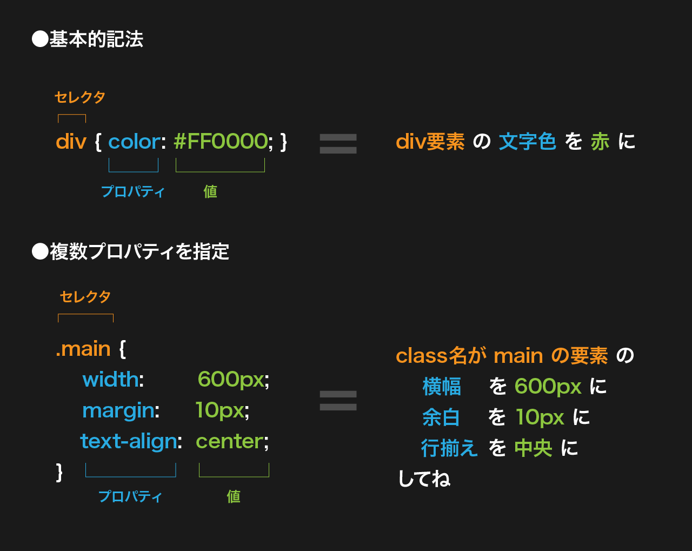

# 基本書式: セレクタとプロパティ

- 基本記法は `セレクタ { プロパティ: 値; }`
- `セレクタ` で対象となる HTML の要素を指定して、`プロパティ` でその要素がどの様なスタイル(振る舞い)なのかを指定する。



## セレクタ

- セレクタは `タグ名` `クラス` `ID` などがが使用できる。
- クラス名はドット`.`、ID 名はシャープ `#` を頭につける。
- セレクタをスペースで区切ると `セレクタ1 セレクタ2 {・・・}` 子要素を指定できる。

## プロパティ

- セレクタの直後に `{ }` をつけ、その中にプロパティを指定する。
- `プロパティ:値;` という形でスタイルを指定する。プロパティと値の間に`:`、値の最後には`;`を記述する。

---

# 記述例

```html
<!-- HTML例 -->
<body>
  <div id="container">
    <header class="site-header">
      <h2 class="site-name">サイト名</h2>
    </header>
    <div class="main-contents">
      <h3 class="page-title">ページタイトルタイトル</h3>
      <div class="page-contents">
        <p>
          テキストテキストテキストテキストテキスト
        </p>
      </div>
    </div>
  </div>
</body>
```

```css
/* --------------------
css記述例
---------------------- */
/* タグセレクタ */
body {
  background-color: #ffffff;
  color: #2222222;
  padding: 10px;
}
/* IDセレクタ */
#container {
  background-color: #e5e5e5;
}
/* クラスセレクタ */
.site-header {
  padding: 10px 40px;
  background-color: #202020;
}

.site-name {
  color: #ffffff;
  font-size: 1.2em;
}
.main-contents {
  width: 600px;
  margin: 0 auto;
  padding-top: 40px;
  text-align: center;
}
/* 子要素セレクタ */
.page-contents p {
  color: #f00;
}
```

> その他セレクタは以下を参照
>
> - [CSS のセレクタとは？覚えておきたい 25 種類と書き方](https://saruwakakun.com/html-css/reference/selector){tatget="\_blank"}
> - [CSS セレクタのチートシート](https://webliker.info/css-selector-cheat-sheet/){tatget="\_blank"}
