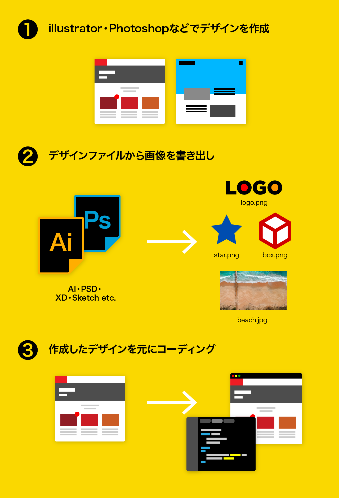
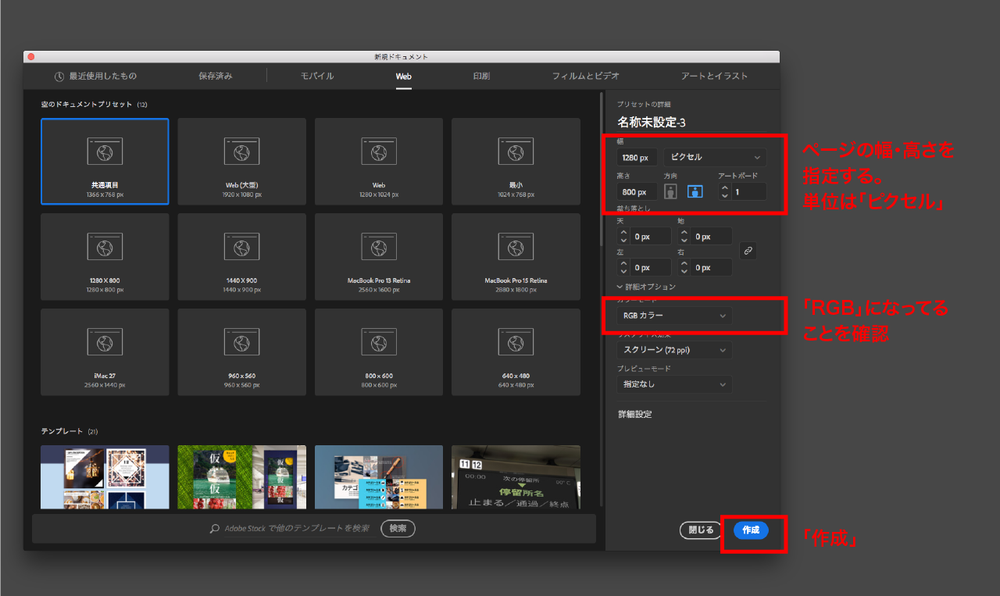
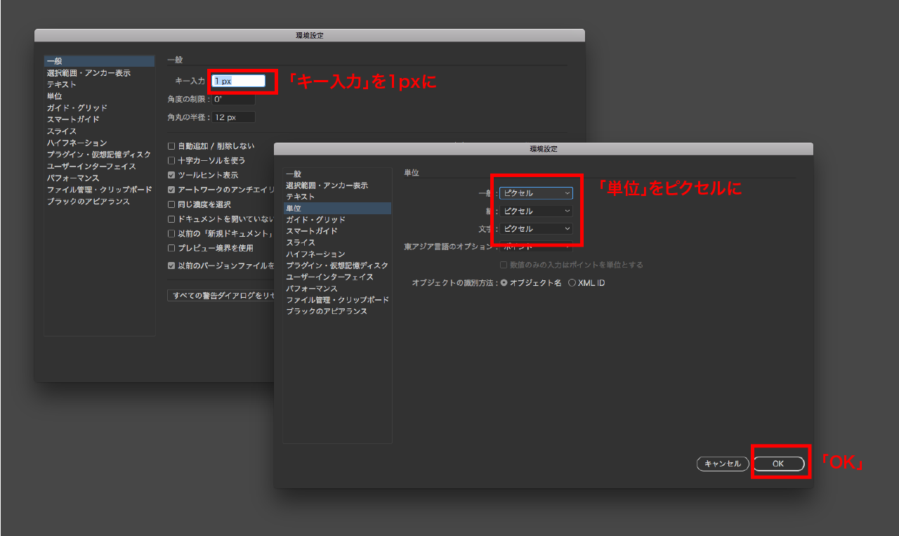
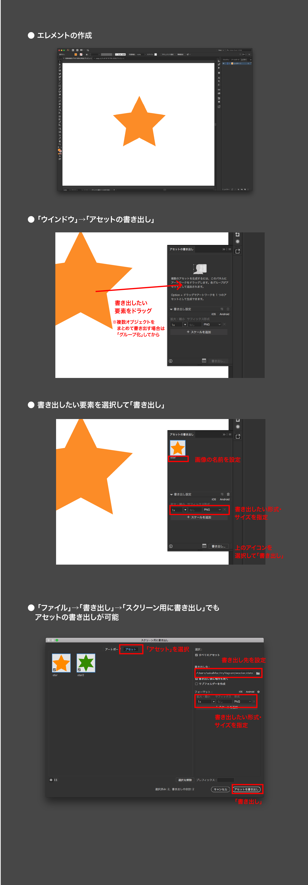

# デザインカンプの作成

サイトの構成や内容が決まった後は、**デザインカンプ**を制作して、それを元にコーディングを進めていく様にしましょう。  
レイアウトやデザインが決まっていない状態でコーディングを始めると手戻りが多く効率が悪いです。

## Webデザインのフロー

illustrator/Photoshopの他にfigmaやXDなどを使用しても良いです。

# illustrator での作成・書き出し方法

今回は `Adobe illustrator` を使用します。

## 新規作成

- Ai を起動し、上部メニューの`ファイル→新規` or `⌘N`
- web プリセットから作成するか、カンバスサイズを指定して作成する。
- 単位は**ピクセル**、カラーモードは **RGB** に設定すること。

> **デザインのサイズについて**  
> デザインを作成する際のサイズは PC 用のデザインでは **1280~1980px**、スマホ用のデザインでは **320〜750px** で作成することが多い。

## Ai 初期設定

- 上部メニューの`illustrator →環境設定→ 一般`
- キー入力を`1px`に
- 同じ画面、右メニューの`単位` を全てピクセルに

## 書き出し

- `「アセットの書き出し」` を利用してサイトに必要な画像を書き出す。
- ※ファイル名は必ず**半角英数字**で指定する。（記号はハイフン、アンダーバーが使用可）

# 画像の形式（フォーマット）について

- 形式によって荒れたりファイルサイズが大きくなったりするので、なるべく適切なフォーマットを使用してください。
- 基本は以下でOKです。
  - **写真** → `JPEG`
  - **ロゴや平面的なイラスト** → `PNG` or `SVG`

|        |                                                                                                                                                                                                                                                                                                                              |
| :----- | ---------------------------------------------------------------------------------------------------------------------------------------------------------------------------------------------------------------------------------------------------------------------------------------------------------------------------- |
| `JPEG` | <small>`拡張子： .jpg / .jpeg`</small>  ● **写真**に向いています。  ● 圧縮レベルが指定できる（0〜100） ● web で使用する場合は 60〜80 くらいがベスト ● 非可逆圧縮なので保存を繰り返すと荒れる ● イラストやロゴなどの平面的な画像には向かない。（png よりもファイルサイズが大きくなったり、荒れが目立つことも） |
| `PNG`  | <small>`拡張子： .png`</small>  ● **イラストやロゴなど**に向いています。  ● **背景透過処理**ができる。る）                                                                                                                                                                                                             |
| `GIF`  | <small>`拡張子： .gif`</small>  ● PNGと同じく透過処理ができるが半透明は使えません。  ● **アニメーション(GIF アニメ)** が作成できます。                                                                                                                                                                                 |
| `SVG`  | <small>`拡張子： .svg`</small>  ● 上記3種がビットマップ画像(ピクセルで構成)なのとは違い SVG は**ベクター画像** です。  ● ビットマップと違い、**拡大しても荒れません。**   ● `XML`で記されてるのであとで編集も可能。  ● htmlに直接記入可能 ● 複雑なイラストや写真には向きません。                              |

# 現在の UI デザインのツール

現在はUI制作に特化したデザインツールが多くあります。  
また、その多くにプロトタイピング(モックアップ) 機能がついており、事前のUXの確認に便利です。

> UI デザイン / プロトタイピングツール 紹介
>
> - [Figma](https://www.figma.com)
> - [Adobe XD](https://www.adobe.com/jp/products/xd.html)
> - [Sketch](https://www.sketch.com/)
> - [inVision](https://www.invisionapp.com/)
