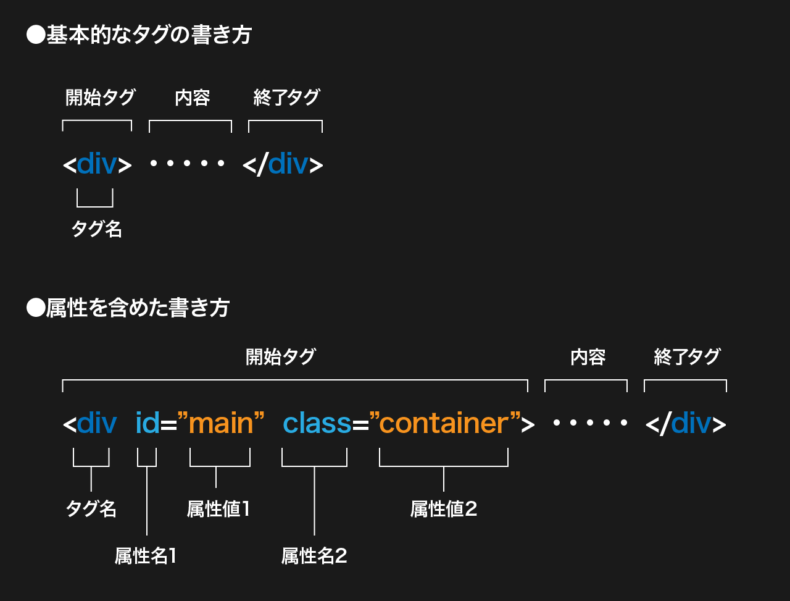
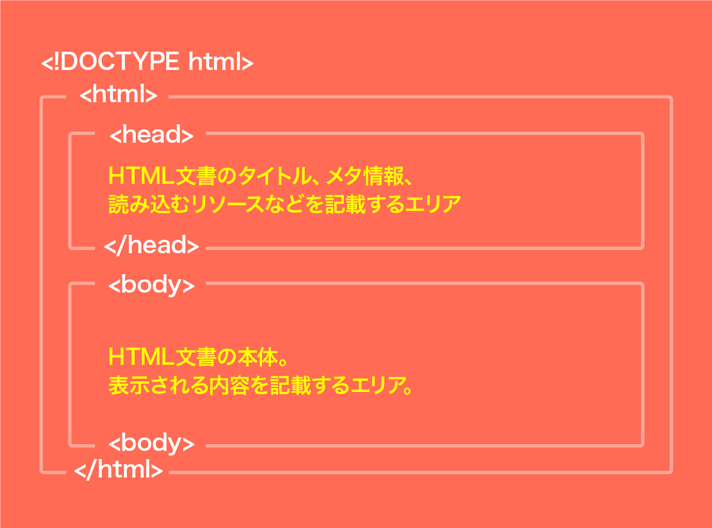

# HTML サンプル

```html
<!DOCTYPE html>
<html lang="ja">
  <head>
    <meta charset="UTF-8" />
    <meta name="viewport" content="width=device-width, initial-scale=1.0" />
    <meta http-equiv="X-UA-Compatible" content="ie=edge" />
    <title>HTMLの基礎</title>
  </head>
  <body>
    <div id="main" class="main-container">
      <h1>HTMLの基礎</h1>
    </div>
  </body>
</html>
```

# タグ・属性の記述ルール

- 開始タグと`<tag>` 終了タグ `</tag>`で内容を囲む。
- 開始タグの中には `class` などの**属性(attribute)**を指定できる。使える属性はタグによって違う。
- 属性は`属性名="属性値"`と記述する。
  また必ず属性値は`"`(ダブルコーテーション)で囲む。
- タグ名、属性名は`半角英字小文字`で記述する。（属性値は大文字でも OK）

> #### 空要素
>
> タグの中には終了タグが必要ない要素もあり、これを空要素という。  
> `<meta>  <br> <hr> <input>` など



# HTML の基本要素

- `<!DOCTYPE html>`（HTML5 で記述されていることを宣言）
- `<html>`文書の大元となる要素
- `<head>`タイトル・メタデータ、css の読み込みなどを記載
- `<body>`ページの内容を記載


