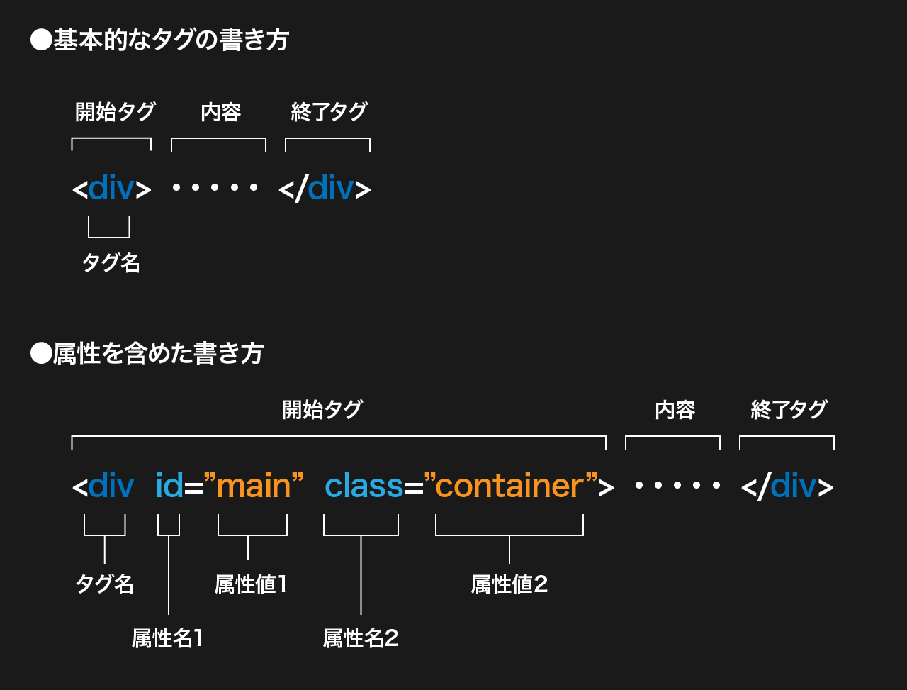

# HTMLとは

- `HyperText Markup Language` の略
- **ページの骨格**にあたるファイルで、ページの内容・構造を`タグ`を使ってブラウザが理解できるように意味付けした**文書**です。
- Webページの基本単位で、1つのHTMLが1ページのWebページとなります。
- 拡張子は`.html`

_HTMLは文書構造を記述するもので装飾やレイアウトはしません。_ HTML文書のスタイリングにはCSSを使います。

> **HyperText とは？**  
> 元々は研究機関で文書の整理のため発明されたもので、文書同士を相互にリンク(ハイパーリンク)させ、自由に横断できる「超」テキストとして作られました。
>
> - 引用：[HTMLって何だ -- ごく簡単な HTML の説明](https://www.kanzaki.com/docs/html/htminfo10.html)
> - 参考: [世界最初のWebサイト](http://info.cern.ch/hypertext/WWW/TheProject.html)

# HTMLの構造

HTMLは`タグ`と呼ばれる記号で記述された階層構造（入れ子構造）になっています。  
タグには開始タグと終了タグがあり、要素の始まりと終わりを定義できます。 ex. `<h1>これはh1要素です。</h1>`

1つのタグで囲われた部分を`要素` と呼びます。ある要素の中に入っている要素を `子要素`・`孫要素` と呼びます。

```html
<html>
  <head>
    <title>HTMLの基礎</title>
  </head>
  <body>
    <h1>HTMLの基礎</h1>
    <p>HTMLは<em>タグ</em>と<em>文章</em>でできている。</p>
  </body>
</html>
```

> #### 演習
>
> HTMLの階層構造を理解するためにChromeのデベロッパーツールでHTMLをみてみましょう。
>
> 1. 適当なページ上で右クリック=>「検証」をクリック
> 1. 「要素」タブにそのページのHTMLの構造が表示されます。
> 1. タグの中にタグが入っている構造が確認できます。

# タグ・属性の記述ルール

- 開始タグと`<tag>` 終了タグ `</tag>`で内容を囲みます。
- タグには[決められた種類](/html/2/#%E5%9F%BA%E6%9C%AC%E7%9A%84%E3%81%AA%E3%82%BF%E3%82%B0)があり、適切なタグを選択して記述してください。
- 開始タグの中には `class` `id` などの **属性(attribute)** を指定できます。  
  使える属性はタグによって違いがあります。
- 属性は`属性名="属性値"`と記述します。  
  属性値は必ず`"`(ダブルコーテーション)で囲んでください。
- タグ名、属性名は`半角英字小文字`で記述してください。（属性値は全角文字でもOKです）



> #### 空要素
>
> タグの中には終了タグが必要ない要素もあり、これを`空要素`といいます。  
> `<meta>  <br> <hr> <input>` などが主な空要素です。  
> `<br />`、``の様に書くこともできます。

> #### class属性
>
> class属性はCSSで使用するので、特に使用頻度が高いです。  
> 後々その要素がどういった要素なのか分かる様に、なるべく意味のあるclass名をつけてください。  
> また、基本は日本語などは使わず _半角英字_ で指定する様にしてください。
>
> ❌ `<div class="なまえ">大学太郎</div>` => 日本語はNG  
> ❌ `<div class="abc">大学太郎</div>` => 意味がわからない  
> ⭕️ `<div class="my-name">大学太郎</div>`
>
> 参考:  
> [CSS のクラス名を決めるときに使うリスト](https://qiita.com/manabuyasuda/items/dbb76ed36970bec95470)  
> [コーディング初学者向けに class の命名規則について考えてみた](https://crestadesign.org/css-class/)

# HTMLの基本要素

HTMLをWebページとして作成する際は、以下の要素が必要です。

- `<!DOCTYPE html>`HTMLで記述されていることを宣言
- `<html>タグ`文書の大元となる要素です。
- `<head>タグ`ページタイトル、メタデータ、CSSなどのリソースの読み込みタグなどを記載します。（見た目には表示されません）
- `<body>タグ`ページの内容を記載します。

```html
<!DOCTYPE html>
<html lang="ja">
  <head>
    <!-- メタデータの記述。ここは表示されない -->
    <meta charset="UTF-8" />
    <meta name="viewport" content="width=device-width, initial-scale=1.0" />
    <title>HTMLの基礎</title>
    <meta name="description" content="サイトの説明文" />
    <link rel="stylesheet" href="css/style.css" />
  </head>
  <body>
    <!-- bodyタグに囲まれた部分が実際にブラウザに表示される。 -->
    <div id="main" class="main-container">
      <h1>HTMLの基礎</h1>
      <p>bodyタグに囲まれた部分が<br />実際にブラウザに表示される。</p>
    </div>
  </body>
</html>
```


> #### 演習
>
> 実際にエディターを開いてHTMLファイルを作ってみましょう。
>
> 1. デスクトップにフォルダを作成
> 1. 作成したフォルダをエディタで開く（ファイル単位ではなく、フォルダ単位で開く事を推奨します）
> 1. 新いファイルを作成し、`index.html` という名前で保存
> 1. 作成したHTMLに基本要素を記述し、bodyタグ内に適当なテキストを入力
> 1. 作成したHTMLをブラウザで開く
> 1. ブラウザ上にindex.htmlに入力した内容が表示されているか確認

> #### 参照
>
> - [HTML の基本](https://developer.mozilla.org/ja/docs/Learn/Getting_started_with_the_web/HTML_basics)
