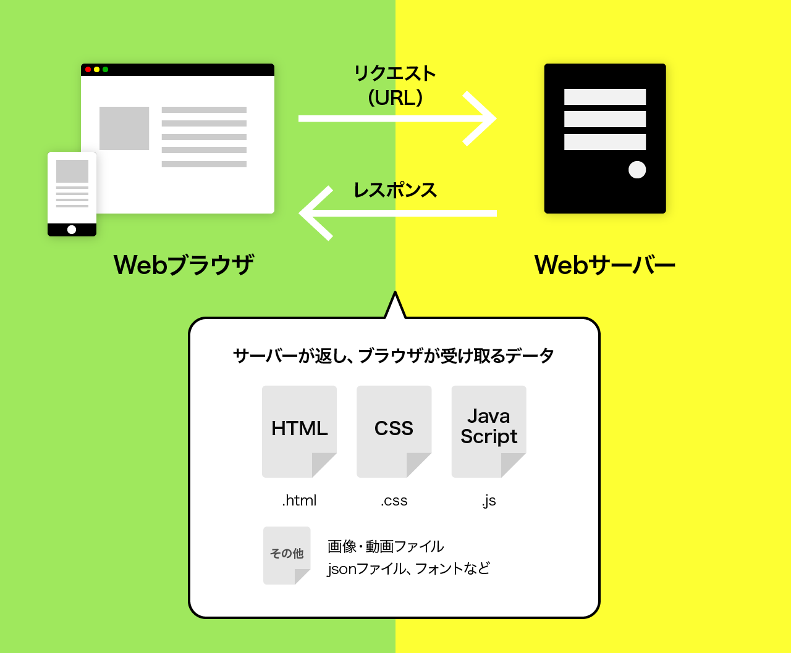
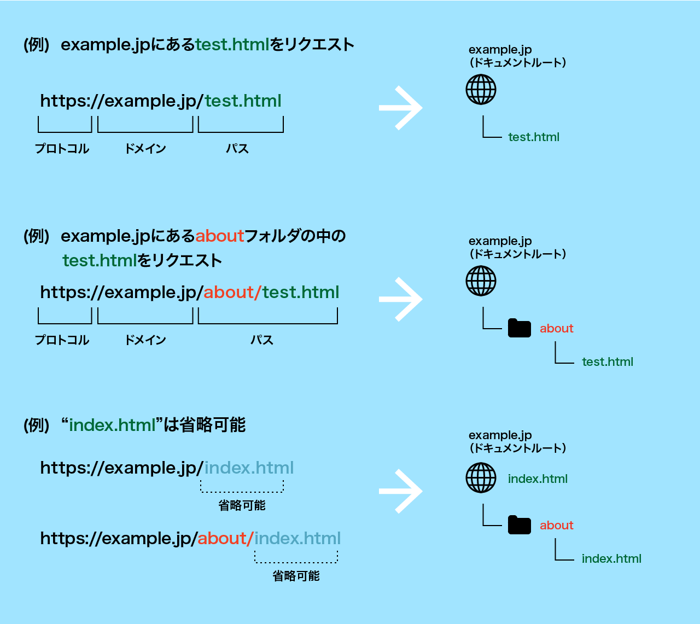

# Webページとは？

Webページはインターネット上に存在する文書やコンテンツが記述されたページのことです。通常、`HTML`という言語を使って作成され、`Webブラウザ`というソフトウェアを通じてインターネット上で閲覧することができます。

Webページは複数のページが集まって `Webサイト`を形成します。Webサイトは、複数の Webページがリンクで繋がれていることで、ユーザーが簡単にページ間を移動できるようになっています。

Webページはブラウザを通じてアクセスされ、[`URL`](#urlとは)（Uniform Resource Locator）と呼ばれるアドレスによって特定のページにアクセスすることができます。ブラウザは、あらゆるデバイスにインストールされており、URL のやりとりを通じて **簡単かつ安全にWebページのコンテンツを共有** することができます。

# Webページが表示される仕組み

1. ブラウザで `URL`を指定 (**リクエスト**)
1. `Webサーバー`からHTMLが返ってくる (**レスポンス**)
1. 取得したHTMLを元にブラウザがページを描画（**レンダリング**）

ブラウザがページを表示するのに使うデータには `HTML` `CSS` `JavaScript` や、画像・動画・フォントなどがあります。  
Webサーバーはリクエストに応じて、上記のデータを返します。

# URLとは

インターネット上の住所（アドレス）のようなものです。

例えば `https://example.jp/foo/bar.html` というURLがあった場合、

- `example.jp` は`ドメイン`と呼ばれ、特定の**サーバーの名前**を表します
- スラッシュ以下の`/foo/bar.html`はファイルパスで、**どのファイル**を取得するか表しています。

<small>＊最初の `https://` はプロトコル（通信する仕組み）を表していてWebはこのHTTPという仕組みを使って送受信を行います。</small>

Webサーバーも一般的なPCのファイルシステムと同じくフォルダが入れ子になった**ツリー構造**になっており、`/` はその階層を表しています。  
`/foo/bar.html` なら**foo**というフォルダの中の **bar.html** という意味。

