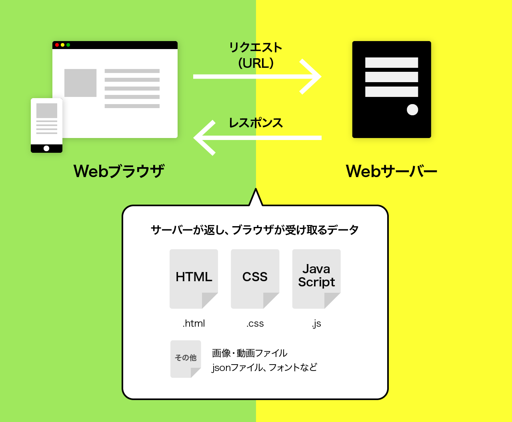

# Webページとは？

Webページはインターネット上に存在する文書やコンテンツが記述されたページのことです。通常、`HTML`という言語を使って作成され、`Webブラウザ`というソフトウェアを通じてインターネット上で閲覧することができます。

Webページは複数のページが集まって `Webサイト`を形成します。Webサイトは、複数の Webページがリンクで繋がれていることで、ユーザーが簡単にページ間を移動できるようになっています。

Webページはブラウザを通じてアクセスされ、[`URL`](#urlとは)（Uniform Resource Locator）と呼ばれるアドレスによって特定のページにアクセスすることができます。ブラウザは、あらゆるデバイスにインストールされており、URL のやりとりを通じて **簡単かつ安全にWebページのコンテンツを共有** することができます。

# Webページが表示される仕組み

Webにおける `ページ`とは通常は `HTML` のことを指します。  
`ブラウザ` はサーバーからHTMLを取得し（必要なデータも取得し）画面に描画します。

1. **リクエスト**: ブラウザで `URL`を指定し、Webサーバーにこのデータを下さい、と要求します。
1. **レスポンス**: `Webサーバー`から、URLに基づいた`HTML`が返ってきます。
1. **レンダリング**: 取得したHTMLを元に、ブラウザが必要なデータを取得し、ページを描画する。

Webページを表示するためにブラウザが使用するデータには `HTML` `CSS` `JavaScript` や、画像、動画、フォントなどがあります。  
これらのデータはWebサーバーがリクエストに応じてブラウザに返します。



# URLとは

インターネット上の住所（アドレス）のようなものです。

例えば `https:/example.com/foo/bar.html` というURLがあった場合、

- `example.jp` は`ドメイン`と呼ばれ、多くは特定の**サーバーの名前**を表します
- スラッシュ以下の`/foo/bar.html`は `ファイルパス` または単に `パス` ととばれ、**どのファイル**を取得するか表しています。

<small>＊最初の `https://` はプロトコル（通信する仕組み）を表しており、Webページこの `HTTP` という仕組みを使って送受信を行います。</small>

Webサーバーは一般的なPCのファイルシステムと同様に、フォルダが入れ子になった**ツリー構造**を持ち、`/`（スラッシュ）はその階層を表しています。  
まるでディレクトリを探索するように、Webサーバーはフォルダの階層を辿りながら、リクエストされたファイルを見つけ出してブラウザに送信します。

`/foo/bar.html` なら**foo**というフォルダの中の **bar.html** という意味になります。


> ブラウザを使用しなくても、HTTP通信を使ってあるURLのWebページ（HTML）を取得できます。  
> ＊コマンドの使用は注意してください。
>
> ```sh
> curl https://web-d.netlify.app/intro/about-web/
> ```
