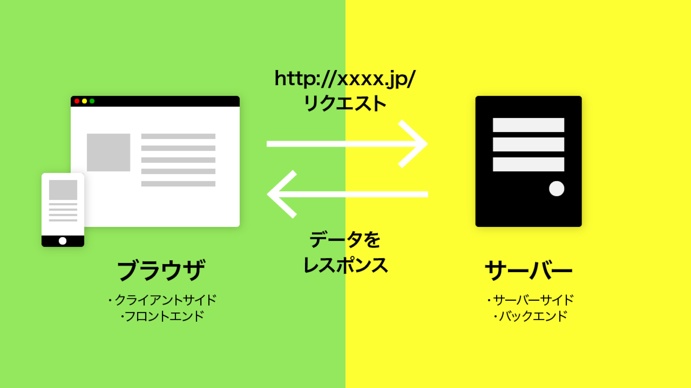
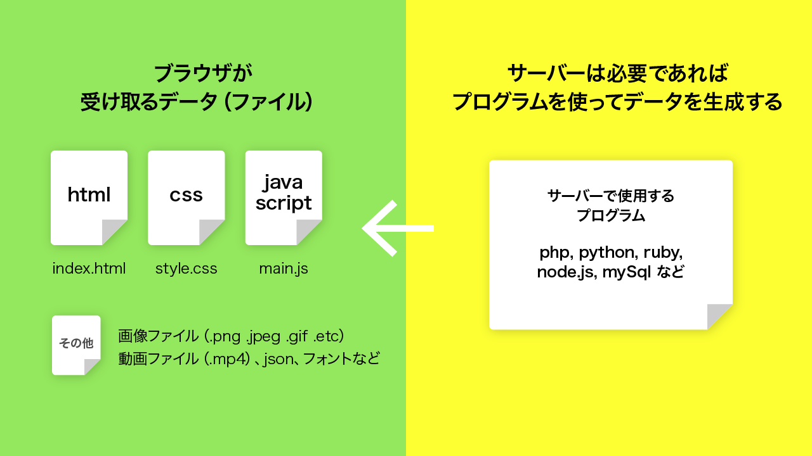
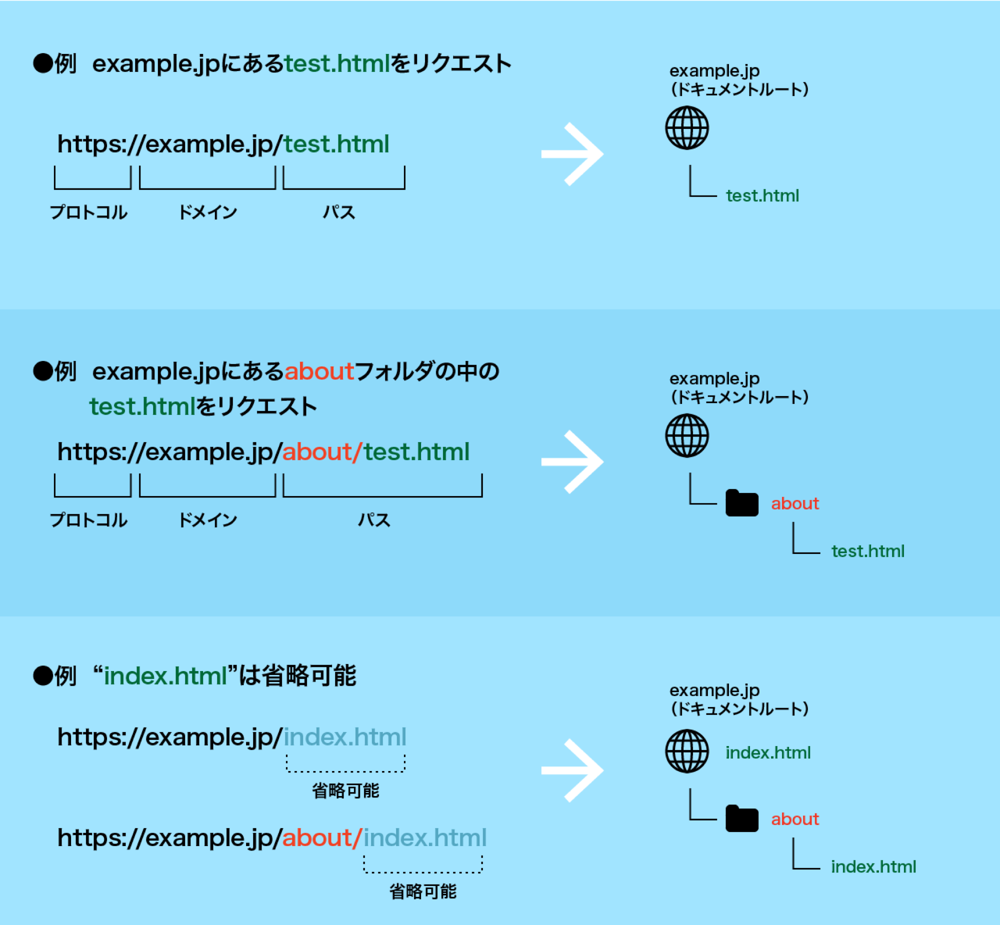

# Web ページとは？

主に `HTML`形式で記述されており、インターネット上に公開されている、`Webブラウザ`で表示されるページのこと。
Web ページが集まり Web サイトとなる。

## Web にも色々ある

Web と言っても様々なジャンルのサイトがあり、必要な技術や知識も幅広い。

- **ブランディングサイト / プロモーションサイト**  
  企業や店舗、商品、ブランド、サービスなどを紹介するサイト。
- **Web アプリ / Web サービス**  
  機能やサービスを提供するサイト。  
  また、コンテンツそのものが売り物になるサイト。
- **ショッピングサイト**  
  Web 上で買い物ができるサイト。
- **メディアサイト**  
  記事やニュースなどを配信するサイト。
- **SNS**  
  インターネット上での交流サービス。

  etc.

# Web ブラウザとは

Web ページを閲覧するためのアプリケーション。
PC やタブレット・スマホはもちろん、ゲーム機器やテレビなどにもインストールされている。

あらゆるデバイスにインストールされているため、URL のやりとりのみで簡単にコンテンツを共有することができる。

# Web ページが表示されるまで

1. ブラウザで `URL`を指定 (**リクエスト**)。
1. `Webサーバー`からデータ(HTML・CSS・JavaScript や画像・フォントなど)が返ってくる (**レスポンス**)。
1. サーバーから取得したデータを、ブラウザが解釈しウィンドウに`レンダリング(描画)`する。

※ サーバー側の事を`サーバーサイド`、またそこで行われる処理を `バックエンド`と呼ぶ。  
※ ブラウザ側の事を`クライアントサイド` 、またそこで行われる処理を `フロントエンド`と呼ぶ。

  

## URL とは

インターネット上の住所のようなもの。  
ドメイン`example.jp` 部分で**サーバー**なのか、 `/(スラッシュ)`以下で**どのファイル**を取得するか指定する。
Web サーバーも一般的な PC と同じくフォルダが入れ子になった `ツリー構造`になっており、 `/ファイル・フォルダ名` で取得するファイルを指定する。

