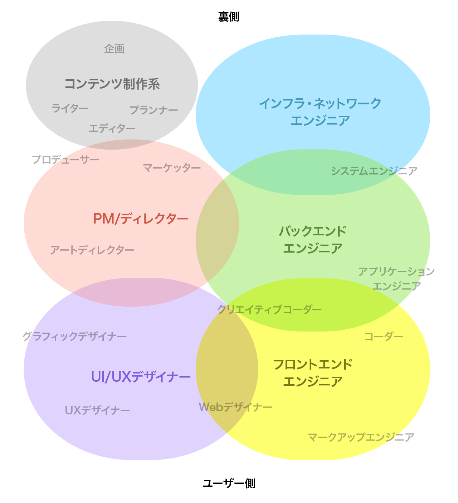
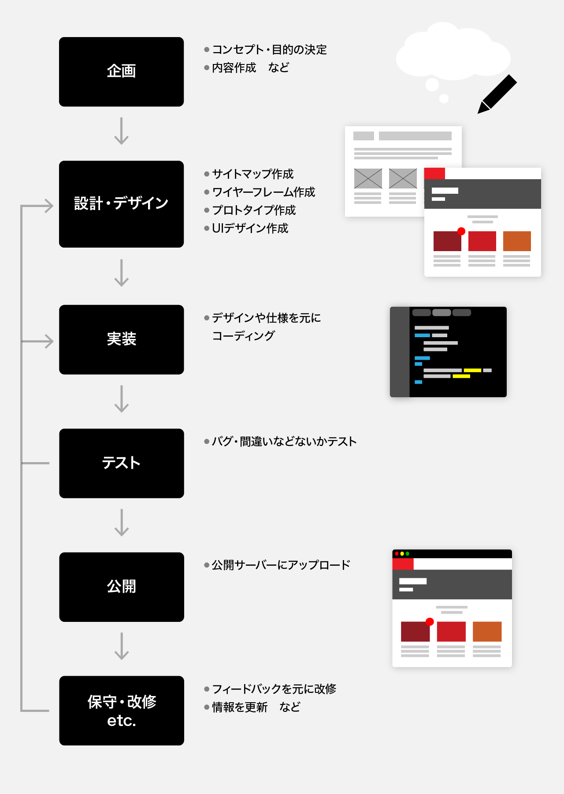

# Web制作に関わる職種

Web制作に関わる職種は多岐にわたり、以下のような役割や職種があります。

- **フロントエンドエンジニア**  
  Webページのユーザーインターフェース(`UI`)を実装する役割で、HTML、CSS、JavaScriptを使ってWebページの見た目や動作を作成します。
- **バックエンドエンジニア**  
  Webサイトの裏側でデータの処理やデータベースの設計・運用を担当する役割で、サーバーサイドのプログラム言語やデータベースの知識が必要です。
- **UI/UX デザイナー**  
   Webページのデザインを担当し、視覚的なレイアウトやデザイン要素を考える役割です。また、Webページのユーザーエクスペリエンス（UX）を考え、ユーザーの使いやすさや満足度を向上させるためのデザインを行います。
- **プロジェクトマネージャー/ディレクター**  
   Web制作プロジェクト全体を管理し、スケジュールや予算の管理、チームのコーディネーションなどを担当する役割です。
- **コンテンツエディター/ライター**  
  Webページのコンテンツの作成や編集を担当する役割で、文章や画像、動画などのコンテンツを制作します。



# Web 制作のフロー(例)

制作のおおまかな流れは以下です。



# Web 制作のツール

## 設計・デザインツール

`Figma`, `Adobe XD` , `Sketch` などの UI デザインアプリや、`illustrator` , `Photoshop` などのグラフィックアプリなど、用途やチーム毎に違います。  
作りたい物に合わせて選択することが大切です。

## コーディングツール

コーディング/プログラミングの記述には一般的に **テキストエディタ** や**IDE** を使用します。  
この講義では [Visual Studio Code](https://code.visualstudio.com/) を推奨しますが、好きなエディタや IDE があれば自由に選択してください。

# 開発言語について

サーバーサイドでは様々な言語が使用可能(PHP,Java,Python etc.)ですが、ブラウザが理解する言語は基本的に `HTML` `CSS` `JavaScript` のみです。  
この講義では上記言語（**フロントエンド言語**と呼ばれます）のみを対称とします。

### HTML

- `マークアップ言語` の一種で、Webページの骨格を構成するファイルです。
- Webページの基本単位で、1つのHTMLが1ページのWebページとなります。
- `タグ` を使ってページの内容や構造をブラウザが理解できるように**意味付けされた文書**です。
- 拡張子は `.html`。

```html
<html>
  <body>
    <div id="article">
      <h1 class="title">HTMLとは</h1>
      <p>HyperText Markup Language の略</p>
    </div>
  </body>
</html>
```

### CSS

- ”Cascading Style Sheets”の略。`スタイルシート`とも呼ばれます。
- CSSは、**HTMLの各要素を装飾**するために使用される言語で、カラーやサイズ、レイアウトなどを指定することができます。
- 拡張子は`.css` ですが、HTMLの中に含める事もできます。

```css
.title {
  color: #ff0000;
  font-size: 24px;
}
```

### JavaScript

- ブラウザで動作するほぼ **唯一のプログラミング言語**で、略称でJSとも呼ばれています。（Javaとは異なります）
- JavaScriptは、ユーザーインタラクションやアニメーション、アプリ開発など、多岐にわたる場面で使用されています。
- 拡張子は`.js`ですが、HTMLの中に含める事もできます。

```JS
function greeting(name){
  alert('Hello, ' + name)
}
greeting('Tanaka');
```
