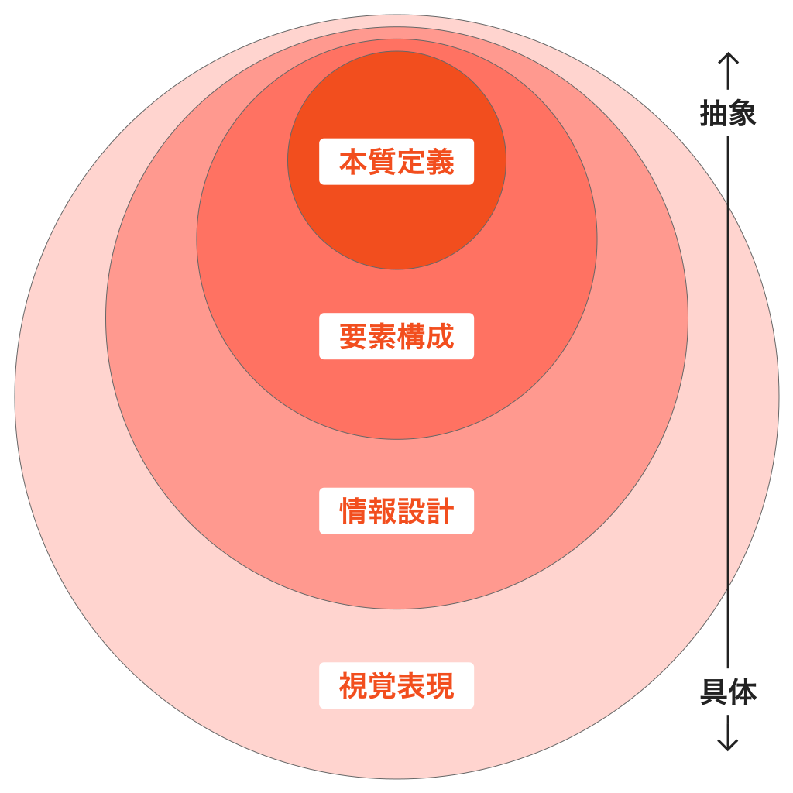

# Webデザインについて

Webデザインとは、Webサイトにおける見た目や構成を設計し、情報を分かりやすく魅力的に伝えるためのデザイン領域です。レイアウトや配色、タイポグラフィ、画像の使い方などを通じて、サイトの印象を形づくるとともに、ユーザーが快適に閲覧できるよう工夫する役割を担います。

また、Web/アプリを含むのデジタルプロダクト全体のデザインは `UIデザイン` と呼ばれます。  
ユーザーがWebサイトやアプリを操作する際のインターフェースを設計し、多くの場合は直感的で使いやすい体験を実現するためのデザインです。

# UIデザインを構成する4つのレイヤー



- **本質定義** `Concept`  
  デザインの目的や価値、届けたい"核"を言語化します。「なぜこれをつくるのか？」「誰に、何を伝えたいのか？」を明確にします。
- **要素構成** `Contents`  
  伝えたい情報や必要な機能を収集・選択し、何を含めて、何を削るかを判断します。
- **情報設計** `Information Architecture`  
  要素の関係性を整理し、情報の構造と流れ、インタラクションを設計します。ユーザーがどう動くか、どこに何があるべきかをマッピングします。
- **視覚表現** `Concept`  
  色・形・レイアウト・タイポグラフィ・インタラクションなどで具体化し、最終的なビジュアルに落とし込みます。

これは一方向に進むプロセスではなく、行き来しながら設計を深め、反復的に磨き上げていくもので、どのレイヤーから着手してもかまいません。
また、企画・開発・運用、実際に使用するユーザーなど、自分以外のさまざまな領域の人と対話を重ねるこもとも重要です。

また、デザインには必ず「意味」が存在します。  
自分がデザインしたものにどういう意図があるのか、なるべく言語化することを心がけてください。

> - 参考: [UXデザイナー Jesse James Garrett 氏の “The Elements of User Experience” ](http://www.jjg.net/elements/translations/elements_jp.pdf)

# Web 制作のツール

## 情報設計・デザインツール

UIデザインには `Figma` に代表されるUIデザインアプリが便利です。  
ただ、Figmaはレイアウトに特化したツールなので、ロゴやアートワークの作成・調整には `Adobe Illustrator / Photoshop` などのグラフィックアプリの方が向いています。

また、構想を練る段階では、単なるテキストや手書きの方が良いかもしれません。  
作りたい物に合わせて選択することが大切です。

## コーディングツール

コードやプログラムの記述には一般的に専用のテキストエディタ や IDE を使用します。  
この講義では [Visual Studio Code](https://code.visualstudio.com/) を推奨しますが、好きなエディタや IDE があれば自由に選択してください。

# 開発言語について

サーバーサイドではPHP, Node.js, Java, Python など、様々な言語が使用可能ですが、ブラウザが理解する言語は基本的に `HTML` `CSS` `JavaScript` のみです。  
この講義では上記言語（ `フロントエンド言語` と呼ばれます）のみを対象とします。

### HTML

- `マークアップ言語` の一種で、Webページの骨格を構成するファイルです。
- Webページの基本単位で、**1つのHTMLが1ページのWebページ** となります。
- `タグ` という構文を使ってページの内容や構造をブラウザが理解できるように**意味付けされた文書**です。
- 拡張子は `.html`。

```html
<html>
  <body>
    <div id="article">
      <h1 class="title">HTMLとは</h1>
      <p>HyperText Markup Language の略</p>
    </div>
  </body>
</html>
```

### CSS

- ”Cascading Style Sheets”の略。`スタイルシート`とも呼ばれます。
- CSSは、**HTMLの各要素を装飾**するために使用される言語で、カラーやサイズ、レイアウトなどを指定することができます。
- 拡張子は`.css` （HTMLの中に含める事もできます）

```css
body {
  background-color: #ffffff;
}
.title {
  color: #ff0000;
  font-size: 24px;
}
```

### JavaScript

- ブラウザで動作するほぼ **唯一のプログラミング言語**で、略称でJSとも呼ばれています。（Javaとは異なります）
- JavaScriptは、ユーザーインタラクションやアニメーション、データ取得、アプリ開発フレームワークなど、多岐にわたる場面で使用されています。
- 拡張子は`.js` （HTMLの中に含める事もできます）

```JS
function greeting(name){
  alert('Hello, ' + name)
}
greeting('Tanaka');
```
