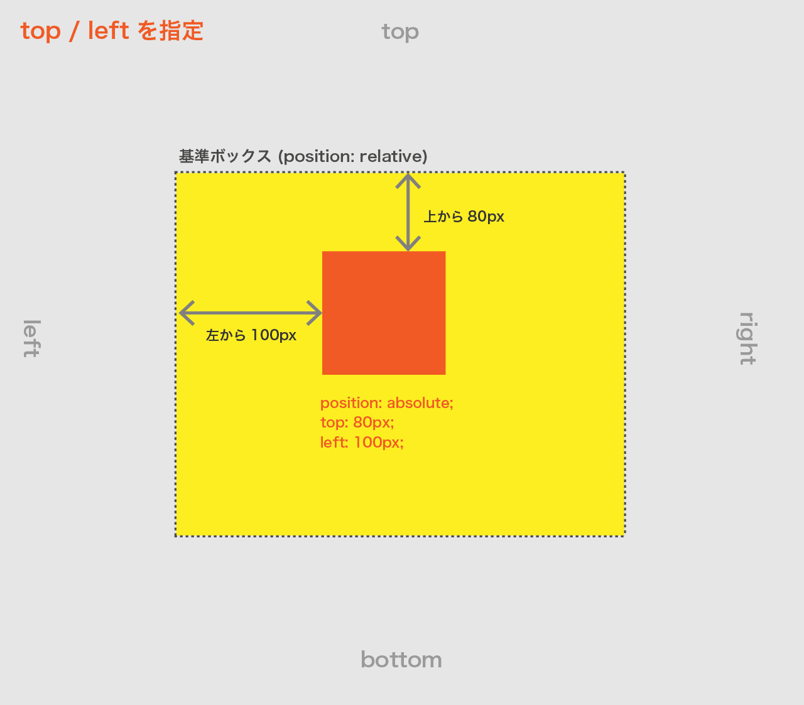

# position プロパティ(要素の配置)

要素の配置方法を指定するために使用されるプロパティです。  
**基準となるボックスからの要素の位置**を指定できます。

主な値は以下となります。

|                |                                                                                                                                                                                                                                                                                           |
| -------------- | ----------------------------------------------------------------------------------------------------------------------------------------------------------------------------------------------------------------------------------------------------------------------------------------- |
| **`static`**   | 初期値。要素を通常の流れに従って配置します。                                                                                                                                                                                                                                              |
| **`relative`** | 要素を自身の元々の位置を基準にして相対的に配置します。<br>子要素に `absolute` が設定された場合は、その**基準ボックス**となります。                                                                                                                                                        |
| **`absolute`** | 要素を絶対的な位置に配置します。<br>**他の要素との関係は無視されます。**<br>親要素に `static` 以外のpositionが設定されている場合はその要素が**基準ボックス** となります。                                                                                                                 |
| **`fixed`**    | 要素をビューポート（画面上の固定領域）に対して絶対的な位置に配置し、スクロールしても要素は固定されます。<br>**他の要素との関係は無視されます。**<br>また、fixedは常に**ウィンドウが基準ボックス**となります。<br>子要素に `absolute` が設定された場合は、その**基準ボックス**となります。 |
| **`sticky`**   | スクロールした時に指定した位置に固定表示させます。<br>参考: [【CSS】position: sticky; の使い方](https://zero-plus.io/media/use-sticky-to-fix-elements/)                                                                                                                                   |

# position: absolute (絶対位置指定)

- 要素に `position: absolute` 指定し、さらに基準からの位置を `top` `bottom` `left` `right` で指定します。＊位置は全て指定しなくても構いません。
- `position: relative` 等 **static 以外が指定された親要素が基準ボックス**となります。  
  ＊どの親要素にも position: relative が指定されていない場合はウィンドウ(body)が基準となります。
- 単位には `px` `%`などが使用可能です。( %の指定は親要素がのサイズが基準。)
- absoluteが指定された要素の幅は、staticの場合と異なり、デフォルトではその要素の内容に合わせたサイズとなります。

|          |                                |
| -------- | ------------------------------ |
| `top`    | 基準ボックスの**上からの距離** |
| `bottom` | 基準ボックスの**下からの距離** |
| `left`   | 基準ボックスの**左からの距離** |
| `right`  | 基準ボックスの**右からの距離** |

```html
<div class="container">
  <div class="absolute">absolute</div>
</div>
```

```css
/* 親要素 / 基準 */
.container {
  position: relative;
  width: 800px;
  height: 800px;
}
/* 位置指定する要素 */
.absolute {
  position: absolute;
  top: 100px;
  left: 50px;
  width: 100px;
  height: 100px;
}
```




# position: fixed (絶対位置指定 + スクロールしても同じ位置)

- スクロールしても位置は固定されます。
- absolute と違い、`基準ボックスは常にウィンドウ(body)` となります。
- `position: fixed` と `top` `bottom` `left` `right` で位置を指定します。

```css
/* 位置指定する要素 */
.fixed {
  position: fixed;
  top: 0;
  right: 0;
  width: 100px;
  height: 100px;
}
```

<iframe height="600" style="width: 100%;" scrolling="no" title="Position Absolute" src="https://codepen.io/RsakaiForEducation/embed/PoZPBvV?default-tab=html%2Cresult" frameborder="no" loading="lazy" allowtransparency="true" allowfullscreen="true">
  See the Pen <a href="https://codepen.io/RsakaiForEducation/pen/PoZPBvV">
  Position Absolute</a> by R Sakai (<a href="https://codepen.io/RsakaiForEducation">@RsakaiForEducation</a>)
  on <a href="https://codepen.io">CodePen</a>.
</iframe>

# z-index (重なり順)

- 基準ボックス内に位置指定した要素が複数ある場合の重なり順を指定できます。
- 指定は `z-index: 整数`
- 数字が大きいほど上に重なります。

```css
/* 下になる要素 */
.absolute {
  position: absolute;
  top: 100px;
  left: 50px;
  width: 100px;
  height: 100px;
  z-index: 1;
}
/* 上になる要素 */
.absolute2 {
  position: absolute;
  top: 80px;
  left: 30px;
  width: 100px;
  height: 100px;
  z-index: 2;
}
```
