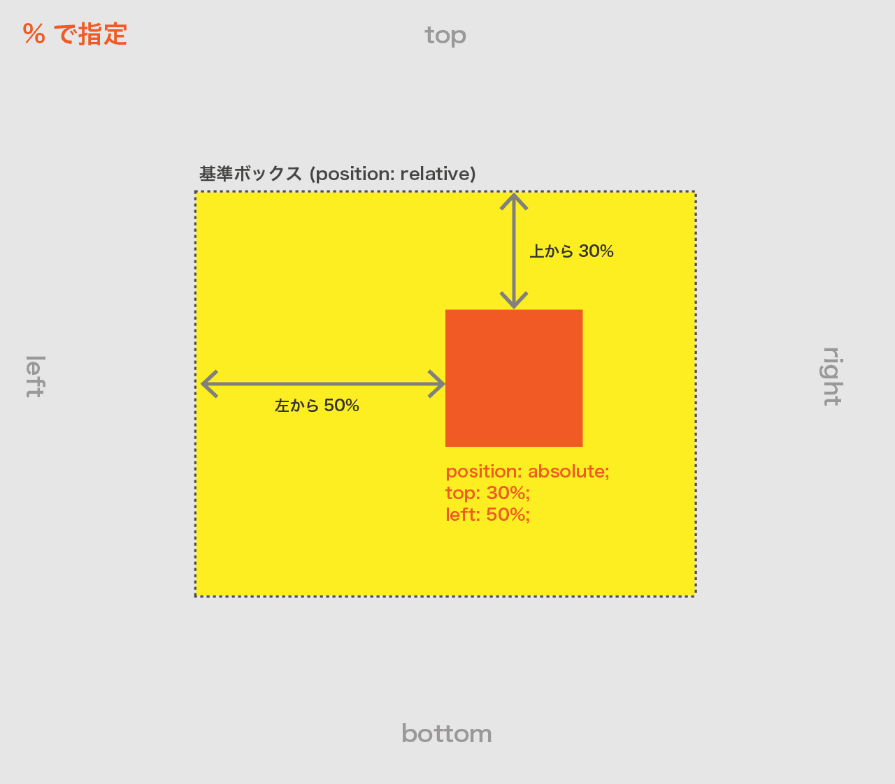

#position プロパティ(要素の配置)

要素の配置方法指定。  
主な値は `relative` `absolute` `fixed` など。※初期値は `staic`

**基準となるボックスからの要素の位置**を指定する。

## position: absolute (絶対位置指定)

- 要素に `position: absolute` と、基準からの位置を `top` `bottom` `left` `right` で指定する。
- `position: relative` 等 static 以外が指定された**親要素が基準ボックス**になる。  
  ＊どの親要素にも position: relative が指定されていない場合はウィンドウ(body)が基準になる。
- 単位には `px` `%`などが使用可能。( %の指定は親要素がのサイズが基準。)

|        |                                |
| ------ | ------------------------------ |
| top    | 基準ボックスの**上からの距離** |
| bottom | 基準ボックスの**下からの距離** |
| left   | 基準ボックスの**左からの距離** |
| right  | 基準ボックスの**右からの距離** |

```css
/* 親要素 / 基準 */
.container {
  position: relative;
  width: 800px;
  height: 800px;
}
/* 位置指定する要素 */
.absolute {
  position: absolute;
  top: 100px;
  left: 50px;
  width: 100px;
  height: 100px;
}
```




## position: fixed (絶対位置指定 + スクロールしても同じ位置)

- スクロールしても位置は固定される
- absolute と違い、`基準ボックスは常にウィンドウ(body)`
- 例えばこのサイトの左上のボタンが `fixed`
- `position: fixed` と `top` `bottom` `left` `right` で指定する。

```css
/* 位置指定する要素 */
.fixed {
  position: fixed;
  top: 0;
  right: 0;
  width: 100px;
  height: 100px;
}
```

## z-index (重なり順)

- 位置指定した要素が複数ある場合の重なり順を指定する。
- 指定は `z-index: 整数`
- 数字が大きいほど上に重なる。

```css
/* 下になる要素 */
.absolute {
  position: absolute;
  top: 100px;
  left: 50px;
  width: 100px;
  height: 100px;
  z-index: 1;
}
/* 上になる要素 */
.absolute2 {
  position: absolute;
  top: 80px;
  left: 30px;
  width: 100px;
  height: 100px;
  z-index: 2;
}
```
