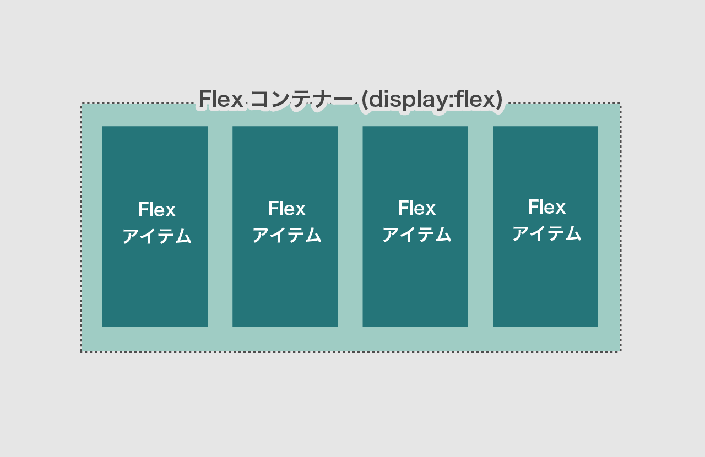

# display: flex / フレックスボックス

横並びなどのレイアウトに使用するプロパティ。子要素の並び方を柔軟に指定できます。

- **親要素(Flex コンテナー)** に `display: flex;`と、関連プロパティ（子要素がどう並ぶか）を指定します。
- **子要素(Flexアイテム)** に関連プロパティ（個別の大きさや順序など）を指定します。

<iframe height="400" style="width: 100%;" scrolling="no" title="flexbox - 0" src="//codepen.io/RsakaiForEducation/embed/xJxdJX/?height=265&theme-id=dark&default-tab=css,result" frameborder="no" allowtransparency="true" allowfullscreen="true">
  See the Pen <a href='https://codepen.io/RsakaiForEducation/pen/xJxdJX/'>flexbox - 0</a> by R Sakai
  (<a href='https://codepen.io/RsakaiForEducation'>@RsakaiForEducation</a>) on <a href='https://codepen.io'>CodePen</a>.
</iframe>

# Flexコンテナー(親要素)に使う主なプロパティ

子要素が**どの様に並ぶか**を指定します。

|                       |                                                                                                                                                                                                                                                                                                                                                                                                                                                                                                                           |
| :-------------------- | ------------------------------------------------------------------------------------------------------------------------------------------------------------------------------------------------------------------------------------------------------------------------------------------------------------------------------------------------------------------------------------------------------------------------------------------------------------------------------------------------------------------------- |
| **`flex-direction`**  | 子要素の並ぶ方向を指定します。 ●`row` 左から右に配置 ●`row-reverse` 右から左に配置。 ●`column` 上から下に配置。  など (例) `flex-direction: row;`                                                                                                                                                                                                                                                                                                                                                          |
| **`flex-wrap`**       | 子要素の折り返しを指定します。 ●`nowrap`子要素を折り返しせず、強制的に一行に並べる ●`wrap` 子要素を自動的に折り返す。  など (例) `flex-wrap: wrap;`                                                                                                                                                                                                                                                                                                                                                           |
| **`justify-content`** | 水平方向 _\*_ の並び方を指定します。 言い方を変えると、アイテムを並べた際に、空いたスペースをどう分配するかを指定するものなので、スペースがなければどの値を取っても同じ見た目となります。  ●`flex-start`行の開始位置から配置。左寄せ。 ●`flex-end` 行末から配置。右寄せ。 ●`center` 中央寄せ。　 ●`space-between` 最初と最後の子要素を両端に配置し、残りの要素は均等に間隔をあけて配置。 ●`space-around` 両端の子要素も含め、均等に間隔をあけて配置。  など (例)`justify-content: space-between;` |
| **`align-items`**     | 垂直方向 _\*_ の並び方を指定します。 ●`stretch`親要素の高さ、またはコンテンツの一番多い子要素の高さに合わせて広げて配置 ●`flex-start` 親要素の開始位置から配置。上寄せ。 ●`center` 上下中央に配置。中央寄せ。 など。                                                                                                                                                                                                                                                                                          |
| **`gap`**             | 子要素間のスペース。横方向のみを指定するには `column-gap`、縦方向のみは `row-gap` 。 (例) ` gap: 10px;` `column-gap: 10px; `                                                                                                                                                                                                                                                                                                                                                                                           |

_＊_ flex-direction が`row`か`row-reverse`のとき。`column`のときは水平・垂直が入れ替わります。

# Flexアイテム(子要素)に主に使うプロパティ

各子要素が **他の要素に対してどの様なサイズで表示するか** を指定します。

|                   |                                                                                                                                                                            |
| :---------------- | -------------------------------------------------------------------------------------------------------------------------------------------------------------------------- |
| **`flex-grow`**   | 子要素の**伸びる比率**。他の子要素に対してどれくらい伸びるかを整数で指定します。(初期値は 0) 0を指定すると自動で伸びない様になります。 (例) `flex-grow: 1;`          |
| **`flex-shrink`** | 子要素の**縮む比率**。 flex-grow と逆で他の子要素に対してどれくらい縮むかを整数で指定します。(初期値は 1) 0を指定すると縮まない様になります。 (例) `flex-shrink: 2;` |
| **`flex-basis`**  | 子要素の**幅**。px,%,auto など、 width プロパティと同じ様に指定します。`auto`にした場合は`width`プロパティが優先されます。 (初期値は `auto`) (例)`flex-basis: 30%;`     |
| **`order`**       | **順序**を+-の整数で指定します。数値の低い順に並びます。 (初期値は 0)                                                                                                      |
| **`margin`**      | ある方向のに `auto` を指定すると、親要素の `justify-content` の値に依らず、その方向のスペースが優先して確保されます。 （例）`margin-left: auto`                         |

# 参考・例

> **Flex ボックス参考**  
> [Flexbox Playground](https://flexbox.tech/)  
> [Flexbox Froggy](https://flexboxfroggy.com/#ja)  
> [日本語対応！CSS Flexbox のチートシート](https://www.webcreatorbox.com/tech/css-flexbox-cheat-sheet)  
> [CSS3 の Flexbox を基本から理解して、使い倒そう！|LIG](https://liginc.co.jp/web/html-css/css/21024)

## 例

<iframe height="700" style="width: 100%;" scrolling="no" title="flexbox - example" src="//codepen.io/RsakaiForEducation/embed/RBwZGG/?height=265&theme-id=dark&default-tab=css,result" frameborder="no" allowtransparency="true" allowfullscreen="true">
  See the Pen <a href='https://codepen.io/RsakaiForEducation/pen/RBwZGG/'>flexbox - example</a> by R Sakai
  (<a href='https://codepen.io/RsakaiForEducation'>@RsakaiForEducation</a>) on <a href='https://codepen.io'>CodePen</a>.
</iframe>

margin: auto を使ったレイアウト。

<iframe height="500" style="width: 100%;" scrolling="no" title="flexbox example2" src="https://codepen.io/RsakaiForEducation/embed/JjmqjOp?default-tab=result" frameborder="no" loading="lazy" allowtransparency="true" allowfullscreen="true">
  See the Pen <a href="https://codepen.io/RsakaiForEducation/pen/JjmqjOp">
  flexbox example2</a> by R Sakai (<a href="https://codepen.io/RsakaiForEducation">@RsakaiForEducation</a>)
  on <a href="https://codepen.io">CodePen</a>.
</iframe>
