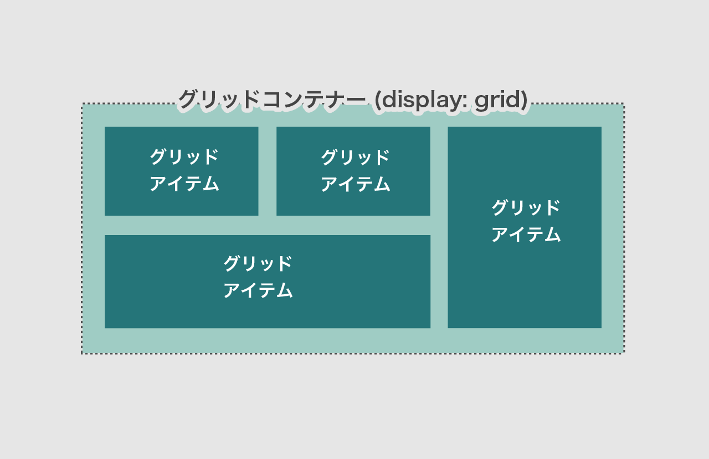
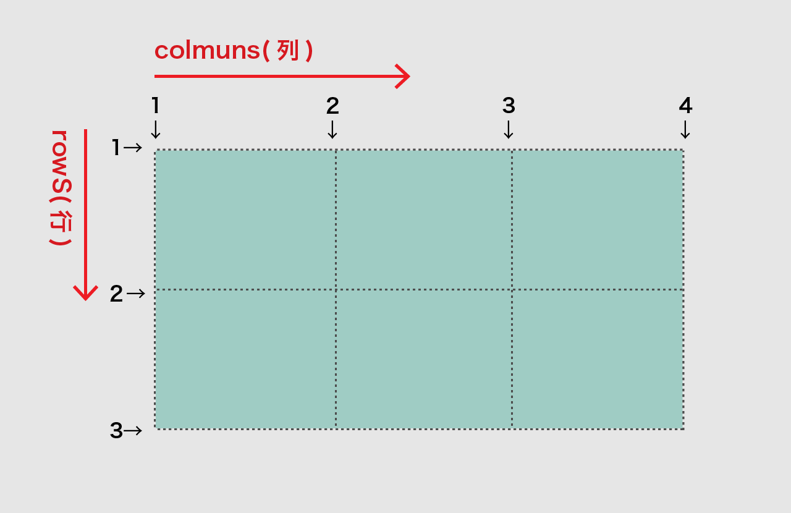
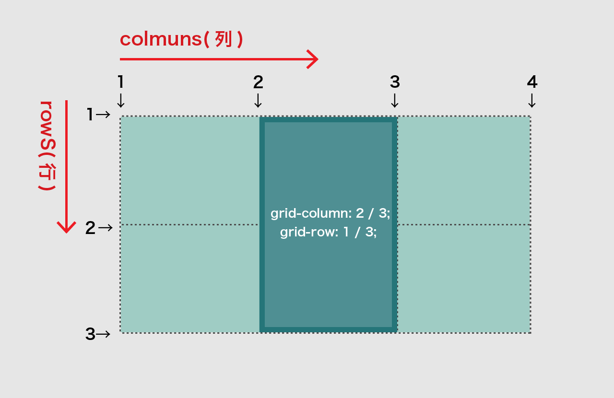

# display: grid / グリッドレイアウト

- 比較的新しい CSS レイアウト。縦横にグリッドを区切って子要素を配置できる。
- **親要素(グリッドコンテナー)**に `display: grid;`と、関連プロパティ（グリッド分割の定義）を指定。
- **子要素(グリッドアイテム)**に関連プロパティ（配置）を指定する。



## 親要素(グリッドコンテナー)にグリッドを定義

- `grid-template-columns` で横の分割を定義
- `grid-template-rows` で縦の分割を定義
- 分割した**境界線**をラインと呼び、番号がつく。



```css
.grid-container {
  display: grid; /* グリッドコンテナに指定*/
  grid-template-columns: 30% 20% 1fr; /* 横方向を３つに分割 */
  grid-template-rows: 200px 200px; /* 縦方向を２つに分割 */
}
```

### グリッドコンテナー(親要素)に使う主なプロパティ

＊グリッドコンテナーには　`display:grid;` を指定

|                         |                                                                                                                                                                                                                                           |
| :---------------------- | ----------------------------------------------------------------------------------------------------------------------------------------------------------------------------------------------------------------------------------------- |
| `grid-template-columns` | 横方向の分割を**スペース区切り**でそれぞれのサイズを指定する。<br>●`grid-template-columns: [1列目] [2列目] ...;` <br>単位は`px` `%` `fr`など ※`fr` は分割する割合を自動で計算してくれる。<br>(例) `grid-template-columns: 100px 30% 1fr;` |
| `grid-template-rows`    | 縦方向の分割を指定。（指定方法は grid-template-columns と同じ）<br>`grid-template-rows: [1行目] [2行目] ...;`<br>(例) `grid-template-rows: 100px 200px;`                                                                                  |

## 子要素(グリッドアイテム)を配置

- **グリッドコンテナー 直下の子要素**に配置方法(どのグリッドエリアに配置するか)を指定する。
- `grid-column` `grid-row` でどのラインからラインまで配置するか指定する。



```css
.grid-item-01 {
  grid-column: 2 / 3; /* 横方向のライン 2から3まで */
  grid-row: 1 / 3; /* 縦方向のライン 1から3まで */
}
```

|                      |                                                                                                          |
| :------------------- | -------------------------------------------------------------------------------------------------------- |
| `grid-column`        | コンテナのグリッドに沿って、要素の左端のラインと右端のラインを指定する。<br>(例) `grid-column: 1 / 2;`   |
| `grid-template-rows` | 要素の上端のラインと下端のラインを指定する。（指定方法は grid-column と同じ）<br>(例) `grid-row: 1 / 2;` |

## 参考

> **CSS Grid レイアウト参考**  
> [CSS Grid Layout を極める！（基礎編）](https://qiita.com/kura07/items/e633b35e33e43240d363){target="\_blank"}  
> [これで分かった！10 分でほとんど理解できる「CSS グリッド」の基礎](https://ferret-plus.com/8351){target="\_blank"}

## 例

<iframe height="600" style="width: 100%;" scrolling="no" title="css grid - example" src="//codepen.io/RsakaiForEducation/embed/GBgpzg/?height=265&theme-id=dark&default-tab=css,result" frameborder="no" allowtransparency="true" allowfullscreen="true">
  See the Pen <a href='https://codepen.io/RsakaiForEducation/pen/GBgpzg/'>css grid - example</a> by R Sakai
  (<a href='https://codepen.io/RsakaiForEducation'>@RsakaiForEducation</a>) on <a href='https://codepen.io'>CodePen</a>.
</iframe>
