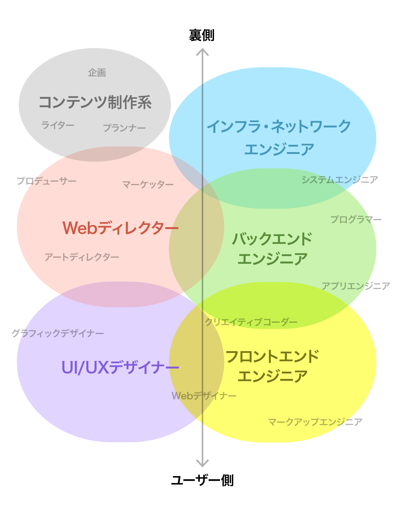
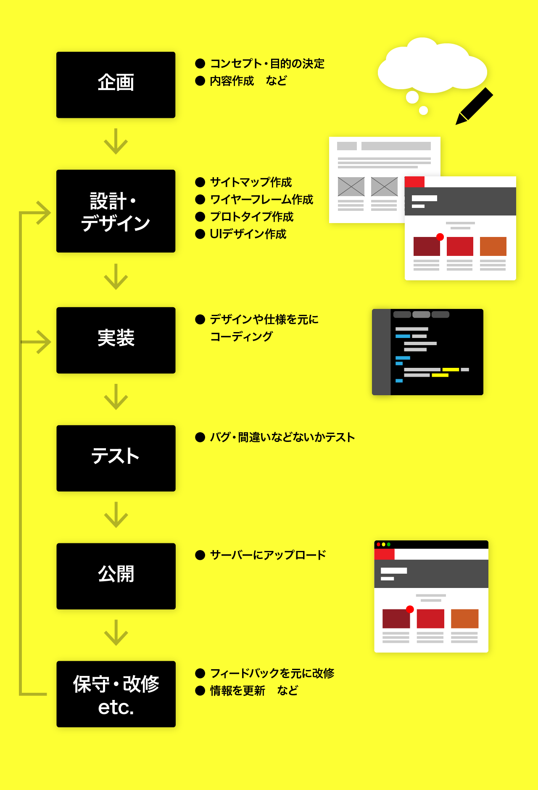

# 制作に関わる職種(役割)

一言に Web 制作と言っても様々な人が関わって制作されている。  
また、昔は単に Web デザイナーやエンジニアと呼ばれていた分野も(呼び方の)細分化が進んでいる。  
ディレクターとデザイナーが兼業だったりフロントとバックが兼業だったり、フロントが数人いたりと案件により異なる。

- **フロントエンドエンジニア**  
  ブラウザ側のコード(JavaScript/HTML/CSS)を書く人。＊HTML/CSS のみの場合はマークアップエンジニアと呼ばれる。
- **バックエンドエンジニア**  
  サーバー側のプログラムを書く人(Java,PHP,Python,RDB,etc.)
- **UI/UX デザイナー**  
  ユーザーインターフェイスや、サイト/アプリの設計・デザインをする人。
- **ディレクター**  
   プロジェクトの取りまとめや、方向性を決める人。

{style="width:600px"}

# Web 制作のフロー(例)

完成までのおおまかな流れは以下。



# Web 制作のツール

## 設計・デザインツール

`Adobe XD` , `Sketch` ,`Figma` などの UI デザインアプリや、`illustrator` , `Photoshop` などのグラフィックアプリなど、用途やチーム毎に違う。  
作りたい物に合わせて選択すること。

## コーディングツール

コーディング/プログラミングは一般的に `テキストエディタ`や`IDE` を使用する。  
本授業では `Visual Studio Code`を使用するが、好きなエディタや IDE があれば自由に選択可。

# 開発言語について

サーバーサイドでは様々な言語が使用可能(PHP,Java,Python etc.)だが  
ブラウザが理解する言語は基本的に `HTML` `CSS` `JavaScript` のみ。  
本授業では上記 `フロントエンド言語` のみを対称とする。

### HTML

- `マークアップ言語` の一種。
- **ページの骨格**にあたるファイルで、ページの内容・構造を`タグ` を使ってブラウザが理解できるように意味付けした**文書**。
- 拡張子は`.html`

```html
<article>
  <h1 class="title">HTMLとは</h1>
  <p>HyperText Markup Language の略</p>
</article>
```

### CSS

- ”Cascading Style Sheets”の略。`スタイルシート`とも呼ばれる。
- HTML 各要素のカラー・サイズ・レイアウトなど、**装飾するため**に使用する。
- 拡張子は`.css`

```css
.title {
  color: #ff0000;
  font-size: 24px;
}
```

### JavaScript

- ブラウザで動作するほぼ**唯一のプログラミング言語**。 `JS`とも呼ばれる。
- ユーザーインタラクションやアニメーション、Web アプリ開発まで、様々なところで使われている。
- 拡張子は`.js`

```JS
function greeting(name){
    alert('Hello, ' + name)
}
greeting('Tanaka');
```
